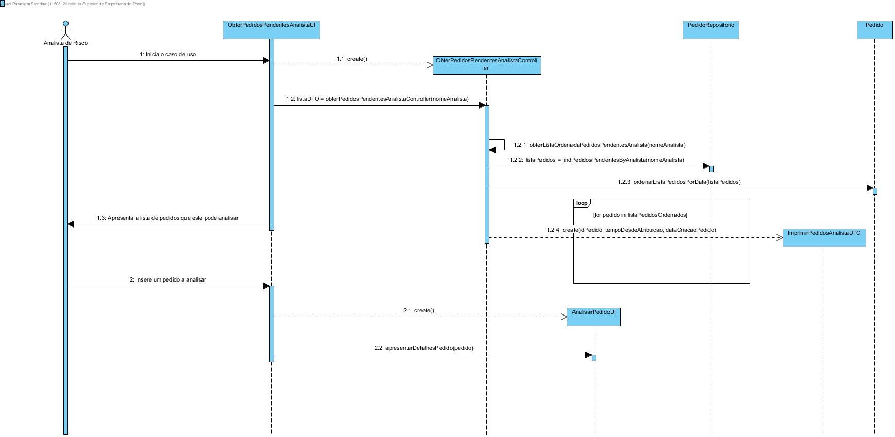
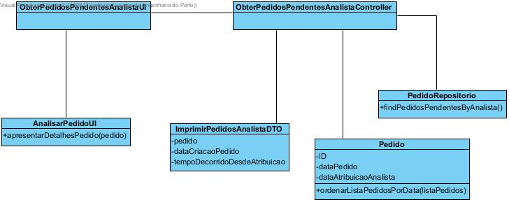
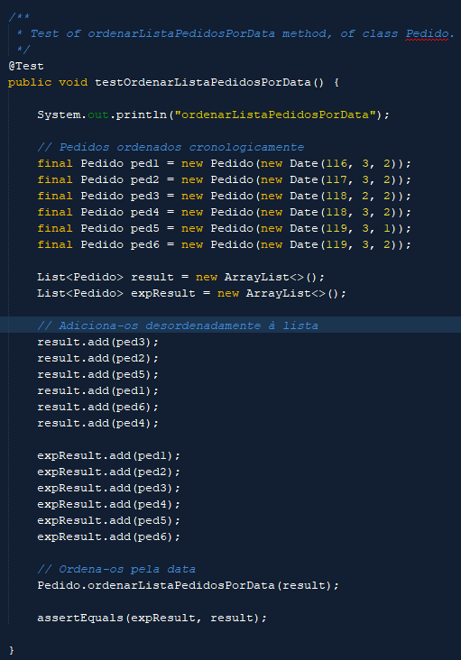
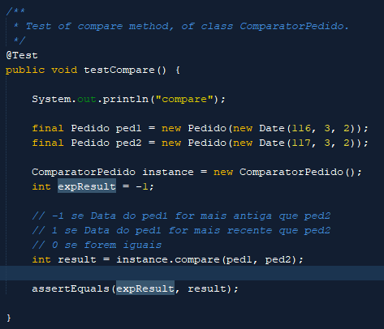
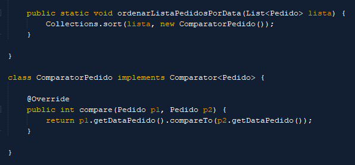
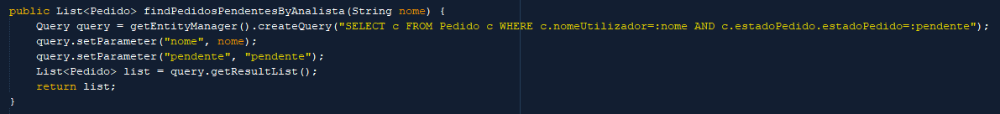
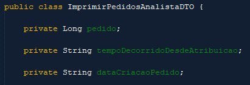

**Aluno [1150812](../)** - AR03
=======================================

# 1. Requisitos

**AR03:** Como AR pretendo consultar os meus (i.e. a mim atribuídos) Pedidos de Avaliação de Risco
pendentes de validação.

* **AR03.1:** Os pedidos devem ser apresentados sempre ordenados dos mais antigos para os mais
recentes e deve ser indicado o tempo decorrido desde a sua atribuição.

* **AR03.2:** Permitir que o AR inicie a análise dum dos Pedidos de Avaliação de Risco pendentes
(i.e. espoletar o requisito AR04).

Esta funcionalidade está inserida no contexto do Analista de Risco (AR), que pretende ser responsável pela obtenção dos pedidos pendentes do analista
de risco logado naquele momento.

Os pedidos obtidos devem ser filtrados tendo em conta a sua data de atribuição, apresentando-os por ordem crescente da sua data. Deve também
ser apresentado o tempo decorrido desde a sua atribuição.

Este UC (AR03) está diretamente ligado com o UC AR04, na medida em que uma das suas opções funciona como despoletador do UC AR04, enviando
um pedido pendente do analista logado para ser tratado pelo UC AR04.

# 2. Análise

**Considerações Importantes para o Design da Solução:**

* A lista de pedidos pendentes de um analista deve ser imprimida no ecrã, logo criou-se um DTO denominado ImprimirPedidosAnalistaDTO, que contém
o ID de um pedido, o seu tempo decorrido desde a atribuição ao analista e a data de criação de pedido. Com este DTO, torna-se muito mais fácil
manipular a informação necessária a passar para a UI, para posterior impressão no ecrã.

* Para ser capaz de ordenar os pedidos pela sua data de criação, de forma a mostrá-los de acordo com este parâmetro no ecrã, foi necessária
a utilização de um Comparator na classe Pedido, que utiliza como critério a data de criação de um pedido para a ordenação destes. Os pedidos
ficam ordenados do mais antigo para o mais recente.

* Para ser possível o cálculo do tempo passado desde a data de atribuição de um pedido, foi implementada uma função, que recebendo como parâmetros
a data de atribuição do pedido e a data atual, devolve o número de dias passados entre estas. Este valor depois é colocado no DTO referido acima
para futura impressão no ecrã.

* Os pedidos a serem apresentados no ecrã deveriam ser filtrados tendo em conta os seguintes atributos: o nome do analista (o pedido tem de pertencer 
ao analista logado) e o estado do pedido (deve ser 'pendente'). Para obter esta lista de pedidos, foi implementado um método no repositório dos pedidos
para devolver uma lista apenas com os pedidos que passam nesta filtragem.

* Por último, após haver garantias que a lista de pedidos a apresentar no ecrã está correta, e de acordo com os requisitos solicitados, é necessário que
o analista escolha um dos pedidos da lista de forma a esta ação acionar o UC AR04, enviando o pedido selecionado para o UC AR04 para depois ser tratado.
Para garantir que depois no UC AR04 se esteja a usar um pedido da lista e não outro que possa ser inválido, é feita uma verificação ao pedido que o analista
insere para análise, e caso este não sejá valido (por exemplo, pede para analisar um pedido fora da lista), é pedido que insira um pedido novamente, até
que o pedido inserido seja válido.

# 3. Design

## 3.1. Realização da Funcionalidade

## 3.2. Diagrama de Classes

## 3.3. Padrões Aplicados

* Foi utilizado o padrão DTO (Data Transfer Object) para organizar mais facilmente os dados a apresentar no ecrã.

* O padrão repositório também foi usado nesta funcionalidade, na medida em que a lista de pedidos pendentes de um
analista é obtido através de uma obtenção filtrada de pedidos no repositório dos pedidos.

## 3.4. Testes

# 4. Implementação

**Comparator usado para ordenação do pedido por data de Pedido:**

**Filtragem dos pedidos a obter através do Repositório:**

**DTO usado para organização da informação a apresentar no ecrã:**

# 5. Integration/Demonstration

* Este UC foi desenvolvido de forma a só poder ser executado quando corretamente logado como analista de risco.

* O UC AR04 é despoletado por este, recebendo um pedido previamente validado durante a execução deste UC.

# 6. Observações

* Os requisitos pretendidos para este UC foram obtidos.

* A nível de documentação, tentei fazer com que esta fosse mais detalhada que a documentação do UC desenvolvido
na semana anterior, após sugestão de alguns professores a este nível. Perguntarei depois aos professores
adequados a que nível esta documentação poderia estar ainda mais desenvolvida, de forma a tentar introduzir
as sugestões oferecidas em trabalhos futuros.