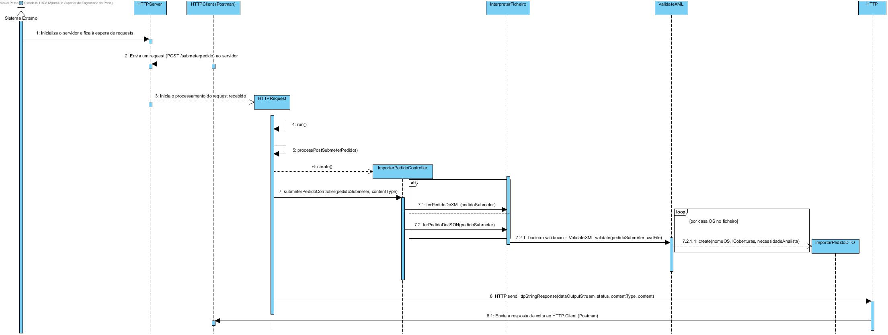
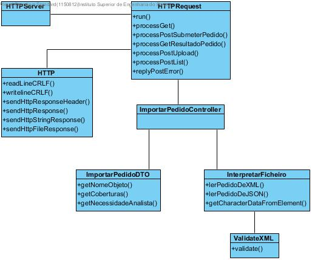
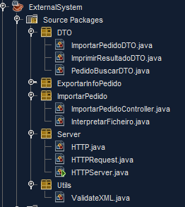

**Aluno [1150812](../)** - SE01
=======================================

# 1. Requisitos

**SE01:** Como SE pretendo submeter um Pedido de Avaliação de Risco para um ou mais locais, sendo
indicado para cada local o conjunto de coberturas pretendido.

Esta funcionalidade está inserida no contexto de um Sistema Externo, que pretende ser responsável pelo processamento
dos pedidos de análise de risco. Todas as funcionalidades relativas a este Sistema Externo terão dependentes da implementação
base deste, que será feita no âmbito do desenvolvimento desta funcionalidade, dado que esta é a primeira funcionalidade do
Sistema Externo a ser desenvolvida.

Para o funcionamento deste UC, será lido um ou mais ficheiros com a informação relativa a um pedido de avaliação de risco,
que conterá a informação sobre os objetos seguros a avaliar, as coberturas de cada um a serem usadas, a identificação da matriz a ser
usada para a avaliação de risco e, se aplicável, informação que reflita se é pretendida a intervenção do Analista de Risco posteriormente ao
processamento do pedido, ou não.

Depois da leitura do ficheiro, estes dados serão persistidos e usados para processar o pedido, persistindo os resultados deste.

# 2. Análise

**Requisitos Técnicos do UC:**

* Os formatos dos ficheiros a serem lidos pelo Sistema Externo serão JSON e XML.

* É necessário que todos os pedidos feitos ao Sistema Externo sejam feitos através de comunicações HTTP(S). Será usado o cliente de HTTP(S) "Postman" para este efeito, sendo que o envio dos ficheiros é feito através deste.
 
**Considerações Importantes para o Design:**

Toda a implementação de código usada em EAPLI para a análise de risco (desde classes de domínio,
persistência, métodos de cálculo de análise de risco) terá de estar presente neste Sistema Externo,
de forma a este ser capaz de:

* Persistir organizadamente os dados lidos de ficheiro (coberturas, objetos seguros, matriz a usar na avaliação...).

* Ser capaz de processar os cálculos da avaliação de risco.

* Ser capaz de criar e devolver novos ficheiros com a informação relativa a pedidos de avaliação de risco.

# 3. Design

## 3.1. Realização da Funcionalidade

## 3.2. Diagrama de Classes

## 3.3. Padrões Aplicados

* Foi utilizado o padrão DTO (Data Transfer Object) para ler e organizar os dados lidos do XML/JSON para depois ser mais fácil proceder
à persistência destes.

* Foi também utilizado o padrão Repositório para proceder à persistência dos dados lidos de XML/JSON.

## 3.4. Testes 
*Nesta secção deve sistematizar como os testes foram concebidos para permitir uma correta aferição da satisfação dos requisitos.*

**Teste 1:** Verificar que a leitura de um pedido sintaticamente correto é confirmado pelo ficheiro XSD validador correspondente.

	@Test
    public void validate() throws SAXException, IOException {
        
        System.out.println("validate");
        
        String xsd = "ImportarPedido.xsd";
        String xml = "<Pedido><ObjetoSeguro><Nome>Isep</Nome><NecessidadeAnalista>sim</NecessidadeAnalista><ListaCoberturas><Cobertura>incendio</Cobertura><Cobertura>sismo</Cobertura></ListaCoberturas></ObjetoSeguro></Pedido>";

        boolean result, expResult = true;

        try {
            System.out.println("Validate XML against XSD Schema");
            SchemaFactory factory = SchemaFactory.newInstance(XMLConstants.W3C_XML_SCHEMA_NS_URI);
            Schema schema = factory.newSchema(new File(xsd));
            Validator validator = schema.newValidator();
            validator.validate(new StreamSource(new StringReader(xml)));
            result = true;
        } catch (IOException e) {
            result = false;
        } catch (SAXException e) {
            System.out.println("Error when validate XML against XSD Schema");
            System.out.println("Message: " + e.getMessage());
            result = false;
        }

        assertEquals(expResult, result);
        
    }

# 4. Implementação

**Organização do UC SE01:**

**Especificações de Implementação:**

* Para validar os ficheiros XML lidos, foi criado um XML Schema que está guardado no servidor, que é invocado sempre que este é necessário.
Caso o ficheiro XML não seja validado pelo XSD, o pedido não é persistido e o programa retorna essa informação.

# 5. Integration/Demonstration

* Foi desenvolvida uma implementação geral para o Sistema Externo, de forma a que todos os UCs relacionados com ele, e não apenas este, pudessem usufruir
dessas funcionalidades.

* Os dados lidos de ficheiro são persistidos de forma a que outras funcionalidades possam tirar proveito deles, seja para o Analista de Risco ter pedidos para analisar,
seja para que o Serviço de Geo Referenciação tenha objetos seguros para, mais tarde, enriquecer com mais informação.

# 6. Observações

Considero que os objetivos principais do desenvolvimento desta funcionalidade foram obtidos com sucesso (leitura, persistência e validação dos dados lidos, envio de respostas com conteúdo e HTTP status
diversificado consoante a situação).

A melhoria principal que, se pudesse, faria a esta funcionalidade, salvo algumas melhorias ligeiras em termos de design, seria a possibilidade de implementação do protocolo HTTPS e autenticação
do sistema externo através de um token/key.