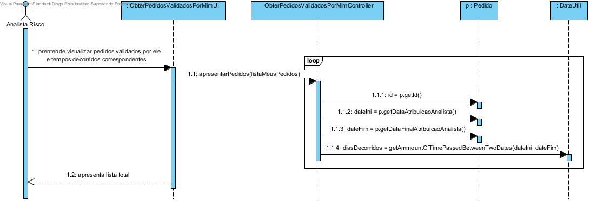
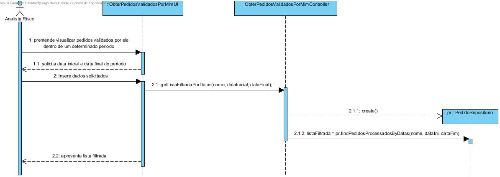
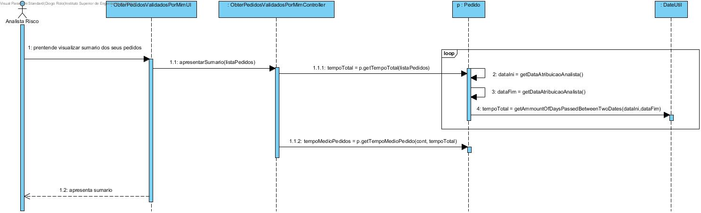
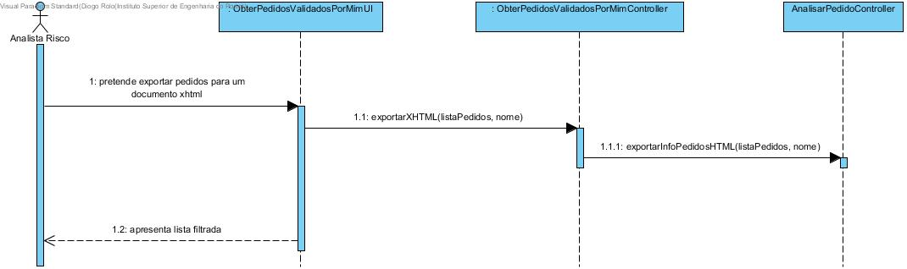
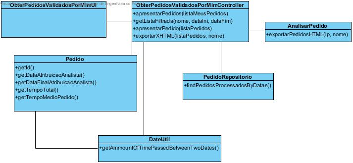

**Aluno [1161199](../)** - AR05
=======================================

# 1. Requisitos

**AR05.** Como AR pretendo consultar os Pedidos de Avaliação de Risco por mim já validados.

• AR05.1. Os pedidos devem ser apresentados sempre ordenados dos mais recentes para os
mais antigos e deve ser indicado o tempo decorrido desde a atribuição até à sua conclusão.

• AR05.2. Permitir (opcionalmente) que os pedidos sejam filtrados para um dado período de tempo.

• AR05.3. Deve ser apresentado um sumário (e.g. quantidade e tempo médio de análise) dos
pedidos apresentados.

• AR05.4. Permitir exportar o resultado da consulta (sumário incluído) para um documento
XHTML.

**Requisitos Técnicos do UC:**

*  O ficheiro exportado XHTML segue um template com nome "templatePedido.html" e "sumario.html" .

# 2. Análise

**Considerações importantes para o Design:**

Para a demonstração deste UC é necessário que já existam pedidos validados anteriormente pelo analista de risco que efetuou o login. Este UC terá um menu especifico com as seguintes opções:

• Ordenar pedidos validados por mim.

• Ordenar pedidos validados por mim dentro de uma determinado período.

• Apresentar um sumário dos pedidos.

• Exportar toda a informação relativa aos meus pedidos incluindo o sumário para um documento XHTML.

# 3. Design

## 3.1. Realização da Funcionalidade

*Fluxo/sequência que permite realizar a funcionalidade.*

Funcionalidade AR04.1:

Funcionalidade AR04.2:

Funcionalidade AR04.3:

Funcionalidade AR04.4:

## 3.2. Diagrama de Classes

*Principais classes envolvidas na realização da funcionalidade.*

## 3.3. Padrões Aplicados

* Foi utilizado o padrão Repositório para aceder aos diferentes dados persistidos anteriormente relativos às diferentes classes utilizadas, neste caso a classe Pedido.

## 3.4. Testes
*Nesta secção sistematizo os testes que foram concebidos para permitir uma correta aferição da satisfação dos requisitos.*

***Classe DateUtilTest***:

**Teste 1:**
* Teste de método que retorna numero de dias entre 2 datas

          /**
          * Test of getAmmountOfDaysPassedBetweenTwoDates method, of class DateUtil.
          */
          @Test
          public void testGetAmmountOfDaysPassedBetweenTwoDates() {
          System.out.println("getAmmountOfDaysPassedBetweenTwoDates");
          Date d1 = new Date(119,10,10);
          Date d2 = new Date(118, 10, 10);
          Long expResult = 365l;
          Long result = DateUtil.getAmmountOfDaysPassedBetweenTwoDates(d1, d2);
          assertEquals(expResult, result);
          }

**Teste 2:**
* Teste de método que retorna tempo total decorrido de todos os pedidos

          /**
          * Test of getTempoTotal method, of class DateUtil.
          */
          @Test
          public void testGetTempoTotal() {
          System.out.println("getTempoTotal");
          List<Pedido> listaPedidos = new ArrayList<>();

          ObjetoSeguro os1 = new ObjetoSeguro("Isep", null, new EnderecoPostal("Porto"));
          AvaliacaoRisco av1 = new AvaliacaoRisco(os1, new ScoreObtido(40), new ScoreMaximo(80), new IndiceAvaliacaoRisco(0.5f));
          Pedido ped1 = new Pedido(os1, "1Ped", av1, new EstadoPedido("processado"), "sim", "RuiBarbosa123", new Date(119, 4, 5), new Date(120, 4, 5), new Date(116, 3, 2));
          ObjetoSeguro os2 = new ObjetoSeguro("Isep", null, new EnderecoPostal("Porto"));
          AvaliacaoRisco av2 = new AvaliacaoRisco(os2, new ScoreObtido(40), new ScoreMaximo(80), new IndiceAvaliacaoRisco(0.5f));
          Pedido ped2 = new Pedido(os2, "1Ped", av2, new EstadoPedido("processado"), "sim", "RuiBarbosa123", new Date(119, 4, 5), new Date(120, 4, 5), new Date(116, 3, 2));

          listaPedidos.add(ped1);
          listaPedidos.add(ped2);

          DateUtil instance = new DateUtil();
          long expResult = 732L;
          long result = instance.getTempoTotal(listaPedidos);
          assertEquals(expResult, result);

          List<Pedido> listaPedidos1 = new ArrayList<>();

          long expResult1 = 0L;
          long result1 = instance.getTempoTotal(listaPedidos1);
          assertEquals(expResult, result);
          }

***Classe PedidoTest***:

**Teste 3:**
* Teste de método que retorna tempo medio de lista de pedidos

          /**
          * Test of getTempoMedioPedido method, of class Pedido.
          */
          @Test
          public void testGetTempoMedioPedido() {
          System.out.println("getTempoMedioPedido");
          int cont = 3;
          long tempoMedio = 1000l;
          Pedido instance = new Pedido();
          long expResult = 333L;
          long result = instance.getTempoMedioPedido(cont, tempoMedio);
          assertEquals(expResult, result);
          }

**Teste 4:**
* Teste de método que retorna lista ordenada do pedido mais recente para o mais antigo

          /**
          * Test of ordenarCrescente method, of class Pedido.
          */
          @Test
          public void testOrdenarCrescente() {
          System.out.println("ordenarCrescente");
          List<Pedido> pedidos = new ArrayList<>();

          Pedido ped1 = new Pedido(null, "1Ped", null, new EstadoPedido("processado"), "sim", "RuiBarbosa123", new Date(119, 4, 5), new Date(120, 4, 5), new Date(116, 3, 2));
          Pedido ped2 = new Pedido(null, "2Ped", null, new EstadoPedido("processado"), "sim", "RuiBarbosa123", new Date(119, 3, 12), new Date(121, 4, 5), new Date(1o19, 2, 5));
          Pedido ped3 = new Pedido(null, "2Ped", null, new EstadoPedido("processado"), "sim", "RuiBarbosa123", new Date(119, 3, 12), new Date(121, 4, 5), new Date(129, 2, 5));
          Pedido ped4 = new Pedido(null, "2Ped", null, new EstadoPedido("processado"), "sim", "RuiBarbosa123", new Date(119, 3, 12), new Date(121, 4, 5), new Date(109, 2, 5));

          pedidos.add(ped1);
          pedidos.add(ped2);
          pedidos.add(ped3);
          pedidos.add(ped4);

          Pedido instance = new Pedido();
          List<Pedido> expResult = new ArrayList<>();

          expResult.add(ped3);
          expResult.add(ped2);
          expResult.add(ped1);
          expResult.add(ped4);

          List<Pedido> result = instance.ordenarCrescente(pedidos);
          assertEquals(expResult, result);
          }

# 4. Implementação

Em relação à conformidade entre a implementação e o design efetuado, ambos se encontram de acordo. Contudo como a implementação foi efetuada posteriormente ao design e existiam ligeiras diferenças não significativas que me obrigaram a alterar de novo o design de forma a que ambos ficassem acertados.

# 5. Integration/Demonstration

Para a integração da funcionalidade desenvolvida, foi então criado um menu próprio e apenas para as funcionalidades deste caso de uso.

* Este UC foi desenvolvido de forma a que só possa ser executado/acedido quando efetuado anteriormente o login do analista de risco.

* As funcionalidades deste UC só podem ser testadas caso o analista de risco esteja anteriormente registado e que tenha também efetuado validações de pedidos, pois, caso contrário não serão apresentados resultados mas sim mensagens de erro.

* Ficheiros Relevantes:

Para exportação do XHTML foram cirados ficheiros template com nome ( templatePedidos.html ) e ( sumario.html ).

# 6. Observações

Acerca do trabalho desenvolvido durante esta terceira semana, considero que foi algo útil e de interesse pessoal. No entanto foram encontradas algumas dificuldades no início da semana em perceber como proceder à exportação de vários pedidos para um documento XHTML, após alguma investigação tudo se tornou mais fácil, conseguindo assim concluir o caso de uso proposto.

As melhorias que, se pudesse, faria a este caso de uso seria o acréscimo de informação relativa ao sumário dos pedidos, assim como uma melhoria na apresentação do documento XHTML para que fosse mais apelativo.
