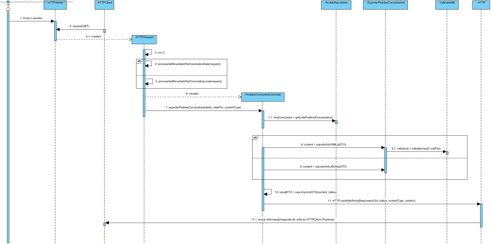
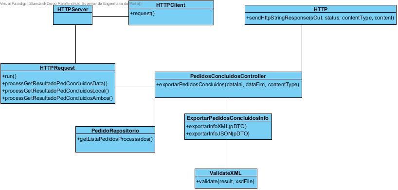
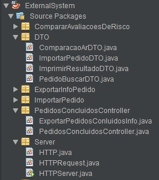

**Aluno [1161199](../)** - SE03
=======================================

# 1. Requisitos

**SE03.** Como SE pretendo obter o resultado dos Pedidos de Avaliação de Risco já concluídos que
satisfazem um determinado conjunto de critérios de filtragem.

• SE03.1. Suportar filtro para um determinado período de tempo.

• Suportar filtro para pedidos relativos a locais pertencentes a uma ou mais cidades.

• SE03.3. Suportar a combinação dos filtros anteriores.

A interpretação feita deste requisito foi no sentido de que esta funcionalidade está inserida num serviço externo (External System) e que tem como objetivo que sejam criadas condições para que seja possível o envio de um HTTP com os dados relativos a esse pedido.

# 2. Análise
**Requisitos Técnicos do UC:**

* Os formatados de saída do sistema externo serão XML, JSON assim como XHTML.

* Como um dos formatos de saída é um ficheiro XML este terá que ser previamente validado, para isso é então criado um XSD. Caso o ficheiro não seja validado deve ser retornado uma mensagem de erro.

* Todas os pedidos efetuados ao sistema externo serão através de ligações HTTP(S). Será então através do "cliente" HTTP(S) Postman, o envio dos ficheiros será através deste.

**Considerações importantes para o Design:**

* Persistir anteriormente Pedidos através do bootstrap.

* Toda a implementação de código usada em EAPLI para a análise de risco (desde classes de domínio, persistência, métodos de cálculo de análise de risco) terá de estar presente neste Sistema Externo, de forma a este ser capaz de:

      • Obter dados anteriormente persistidos após leitura de ficheiros e cálculo de certos dados para então ser possível o envio de uma resposta com todos os dados necessários e relevantes relativos a um dado tipo de pedido

# 3. Design

## 3.1. Realização da Funcionalidade

*Fluxo/sequência que permite realizar a funcionalidade.*

## 3.2. Diagrama de Classes

*Principais classes envolvidas na realização da funcionalidade.*

## 3.3. Padrões Aplicados

Por necessidade de em certos casos ser devolvido 2 ou mais tipos de dados diferentes, foi utilizado o padrão DTO em que os 2 DTO's estão devidamente identificados ( PedidoBuscarDTO ).

Foi também utilizado o padrão Repositório para aceder aos diferentes dados persistidos relativos à classe Pedido (todos os pedidos com estado de pedido processado, ou seja, todos os pedidos concluídos)

## 3.4. Testes
*Nesta secção sistematizo os testes que foram concebidos para permitir uma correta aferição da satisfação dos requisitos.*

**Teste 1:**

*Teste para verificar se determinado XML é ou não válido, neste caso através de um XSD validador.

*  Verificar que é possível inserindo os dados corretos receber informação adicional.

Classe :

        @Test
        public void validate() throws SAXException, IOException {

        System.out.println("validate");

        String xsd = "ImportarPedido.xsd";
        String xml = "<Pedido><ObjetoSeguro><Nome>Isep</Nome><NecessidadeAnalista>sim</NecessidadeAnalista><ListaCoberturas><Cobertura>incendio</Cobertura><Cobertura>sismo</Cobertura></ListaCoberturas></ObjetoSeguro></Pedido>";

        boolean result, expResult = true;

        try {
            System.out.println("Validate XML against XSD Schema");
            SchemaFactory factory = SchemaFactory.newInstance(XMLConstants.W3C_XML_SCHEMA_NS_URI);
            Schema schema = factory.newSchema(new File(xsd));
            Validator validator = schema.newValidator();
            validator.validate(new StreamSource(new StringReader(xml)));
            result = true;
        } catch (IOException e) {
            result = false;
        } catch (SAXException e) {
            System.out.println("Error when validate XML against XSD Schema");
            System.out.println("Message: " + e.getMessage());
            result = false;
        }

        assertEquals(expResult, result);

        }

# 4. Implementação

Em relação à conformidade entre a implementação e o design efetuado, ambos se encontram de acordo. Contudo como a implementação foi efetuada posteriormente ao design existiam ligeiras diferenças não significativas que me obrigaram a alterar o design de forma a que ambos ficassem acertados.

# 5. Integration/Demonstration

Para a integração da funcionalidade desenvolvida, foi então criado um serviço externo denominado de External System.

Neste serviço serão implementadas todas as funcionalidades referentes ao SE.

Este serviço (SE) encontra-se o divido em classes para que haja uma melhor organização do projeto e de forma a tentar garantir uma elevada coesão, estas classes são então:

* HTTPRequest, onde se encontram implementados os métodos que preparam os dados recebidos no pedido para mais tarde ser apenas enviada a informação pretendida dentro de determinados filtros.

* PedidosConcluidosController, onde se encontram implementados os métodos específicos ao tratamento de dados, onde estes encontram determinados pedidos pretendidos dependente da informação obtida no pedido.

* ExportarPedidosConluidosInfo, onde se preparam para ser enviados os resultados dos pedidos em formatos XML e JSON.

* Ficheiros Relevantes:

Para validação do XML foi criado um ficheiro XSD com nome ( BuscarPedidosConcluidos.xsd ) que valida se o XML formado está em conformidade com o resultado esperado.

# 6. Observações

Acerca do trabalho desenvolvido durante esta segunda semana, considero que foi algo útil e de interesse. No entanto foram encontradas algumas dificuldades no início da semana em perceber como proceder ao desenvolvimento da funcionalidade. Após alguma pesquisa foi então possível concluir as tarefas propostas com exceção do formato de saída em XHTML. Após fazer a ligação aos serviços externos tudo se tornou mais fácil, conseguindo assim concluir o caso de uso.

A melhoria principal que encontro seria implementar um protocolo HTTPS.
