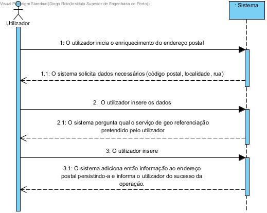
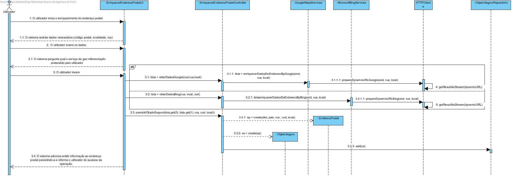
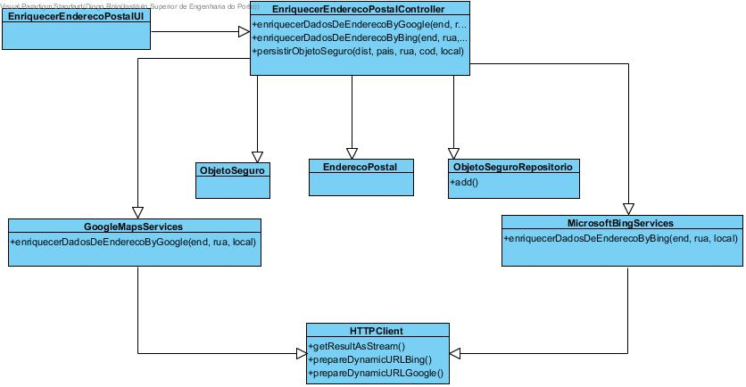
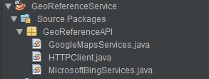

**Aluno [1161199](../)** - SG02
=======================================

# 1. Requisitos

**SG02.** Como SG pretendo enriquecer um determinado endereço postal com a informação relativa à sua localização administrativa como, por exemplo, a localidade, o distrito e o país

• SG02.1. Esta informação deve ser obtida usando o serviço externo MBS.

• SG02.2. Esta informação deve ser obtida usando o serviço externo GMS.

• SG02.3. O sistema deve usar o serviço que estiver configurado para o efeito..

A interpretação feita deste requisito foi no sentido de que esta funcionalidade está inserida num serviço externo de georeferenciação (GeoReferenceService) e que tem como objetivo que sejam criadas condições para que o utilizador do aplicativo através de um endereço postal inserido pelo mesmo consiga enriquecer o endereço postal com informação adicional como o distrito ou o pais.

Para o funcionamento deste UC é então necessário que o serviço faca pedidos ao Google Maps Services - Places API (GMS) e ao Microsoft Bing Services (MBS). o Microsoft Bing Services (MBS).

Depois se obtidos adicionais estes serão então persistidos na base de dados em conjunto com os dados inseridos referentes ao endereço postal do utilizador.

# 2. Análise
**Requisitos Técnicos do UC:**

*  Os pedidos/acesso às API's serão feitos ao serviços da Google Maps e do Microsoft Bing.

**Considerações importantes para o Design:**

* A implementação será organizada através de um interligação modular entre classes no serviço de georeoreferência.

* Persistir organizadamente dados adicionais lidos.

# 3. Design

O utilizador inicia o enriquecimento do endereço postal. O sistema solicita dados necessários (código postal, localidade, rua). O utilizador insere os dados. O sistema pergunta qual o serviço de geo referenciação pretendido pelo utilizador. O utilizador insere. O sistema adiciona então informação ao endereço postal persistindo-a e informa o utilizador do sucesso da operação.

## 3.1. Realização da Funcionalidade

*Fluxo/sequência que permite realizar a funcionalidade.*

## 3.2. Diagrama de Classes

*Principais classes envolvidas na realização da funcionalidade.*

## 3.3. Padrões Aplicados

* Padrão Repositório para proceder à persistência dos dados lidos.

## 3.4. Testes
*Nesta secção sistematizo os testes que foram concebidos para permitir uma correta aferição da satisfação dos requisitos.*

**Teste 1:**

* Verificar que não é possível enriquecer o endereço postal com mais dados pois os dados inseridos não eram corretos.

*  Verificar que é possível inserindo os dados corretos receber informação adicional.

Classe MicrosoftBingServicesTest:

       @Test
       public void testEnriquecerDadosDeEnderecoByBing() throws Exception {
       System.out.println("EnriquecerDadosDeEnderecoByBing");
       String enderecoPostal = "4480";
       String rua = "rua joaquim moreira da silva";
       String localidade = "vila do conde";
       MicrosoftBingServices instance = new MicrosoftBingServices();
       List<String> expResult = new ArrayList<>();
       expResult.add("Porto");
       expResult.add("Portugal");
       List<String> result = instance.EnriquecerDadosDeEnderecoByBing(enderecoPostal, rua, localidade);
       //em caso de erro
       assertEquals(expResult, result);
       enderecoPostal = "..";
       rua = "";
       localidade = "";
       List<String> expResult1 = null;
       List<String> result1 = instance.EnriquecerDadosDeEnderecoByBing(enderecoPostal, rua, localidade);
       assertEquals(expResult1, result1);
       }

**Teste 2:**

* Verificar que não é possível enriquecer o endereço postal com mais dados pois os dados inseridos não eram corretos.

*  Verificar que é possível inserindo os dados corretos receber informação adicional.

Classe GoogleMapsServicesTest:

        @Test
        public void testEnriquecerDadosDeEnderecoByGoogle() throws Exception {
        System.out.println("EnriquecerDadosDeEnderecoByGoogle");
        String endereco = "4480";
        String rua = "rua joaquim moreira da silva";
        String localidade = "vila do conde";
        GoogleMapsServices instance = new GoogleMapsServices();
        List<String> expResult = new ArrayList<>();
        List<String> result = instance.EnriquecerDadosDeEnderecoByGoogle(endereco, rua, localidade);
        expResult.add("Porto");
        expResult.add("Portugal");
        assertEquals(expResult, result);
        endereco = "..";
        rua = "";
        localidade = "";
        List<String> expResult1 = null;
        List<String> result1 = instance.EnriquecerDadosDeEnderecoByGoogle(endereco, rua, localidade);
        assertEquals(expResult1, result1);
        }              

# 4. Implementação

Em relação à conformidade entre a implementação e o design efetuado, ambos se encontram de acordo. Contudo como a implementação foi efetuada posteriormente ao design existiam ligeiras diferenças não significativas que me obrigaram a alterar o design de forma a que ambos ficassem acertados.

# 5. Integration/Demonstration

Para a integração da funcionalidade desenvolvida, foi então criado um serviço externo denominado de GeoReferenceService.

Neste serviço serão implementadas todas as funcionalidades referentes ao SG (Serviço Georeferência).

Este serviço (SG) encontra-se o divido em classes para que haja uma melhor organização do projeto e de forma a tentar garantir uma elevada coesão, estas classes são então:

* HTTPClient, onde se encontram implementados os métodos que preparam os URL para mais tarde se fazer pedidos/ligação às API's;

* MicrosoftBingServices, onde se encontram implementados os métodos específicos às funcionalidade exigidas de acordo com os parâmetros exigidos pela API da Miscrosoft Bing;

* GoogleMapsServices, onde se encontram implementados os métodos específicos às funcionalidade exigidas de acordo com os parâmetros exigidos pela API da Google Maps (Places - API).

# 6. Observações

Acerca do trabalho desenvolvido durante esta primeira semana, considero que foi algo útil e de interesse. No entanto foram encontradas algumas dificuldades no início da semana quer em perceber como proceder ao desenvolvimento da funcionalidade como em compreender corretamente o que era pedido pelo cliente. Após fazer a ligação aos serviços externos tudo se tornou mais fácil, conseguindo assim concluir o caso de uso.

A melhoria principal que, se pudesse, faria a esta funcionalidade seria a possibilidade de o utilizador escolher quais os dados do endereço postal que seriam inseridos no sistema.
